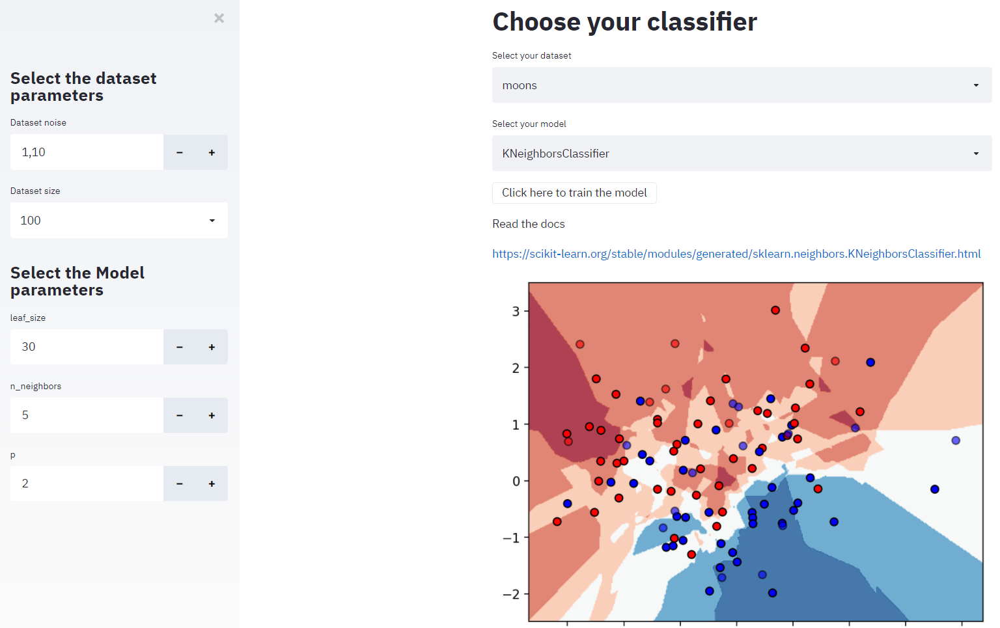

  

# Scikit Learn Playground

Live Demo: https://sklearn-playground.herokuapp.com/

This project is based in the Tensorflow Playground, but for ScikitLearn models

  

## Webapp
To run this webapp locally you must (python 3.7):

1. Download the dependencies:
<pre>
pip install -r requirements.txt
</pre>

2. Execute the app:
<pre>
streamlit run classifier_playground.py
</pre>

3. Access the local host on your command prompt
